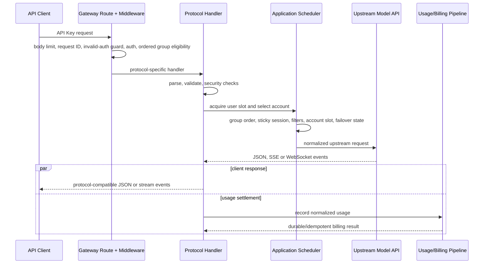
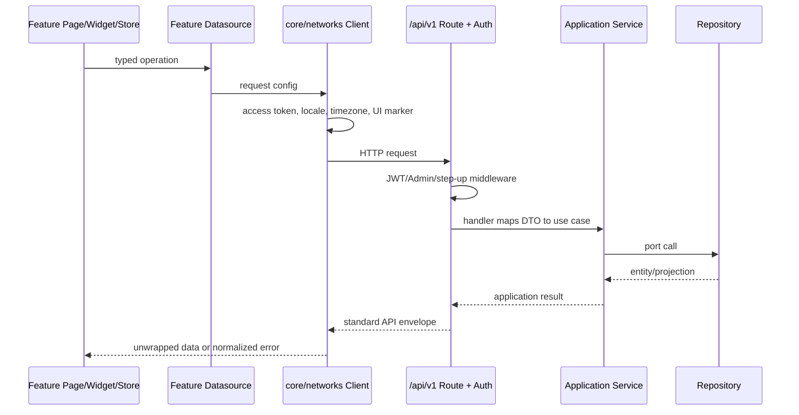

# Sub2API 关键请求链路

本文给出高频链路的阅读顺序和不变量。它刻意省略平台内部的全部分支；调试具体问题时，应从命中的路由和 handler 继续追踪。

## API Key 模型请求

典型入口包括 `/v1/messages`、`/v1/responses`、`/v1/chat/completions`、`/v1beta/...` 以及无 `/v1` 的兼容别名。所有绑定在 `backend/internal/transport/http/server/routes/gateway.go`。



流式事件可能在最终用量结算前已经发送给客户端；这也是结算必须可恢复、幂等且不能依赖客户端连接继续存活的原因。

### 阅读顺序

1. `routes/gateway.go`：确认实际命中路径、middleware 顺序和平台分流。
2. `server/middleware/api_key_auth.go`：确认 API Key、用户、分组和订阅如何进入 context。
3. 协议 handler：Anthropic 从 `gateway_handler_messages.go`，OpenAI Responses 从 `openai_gateway_responses.go` 开始。
4. `application/service/gateway_scheduling.go` 或 `openai_account_scheduler.go`：确认候选账号和会话粘性。
5. 对应 `gateway*_forward*` / `openai*_forward*`：确认上游请求与响应转换。
6. `gateway_usage_billing.go` 或 `openai_gateway_usage.go`：确认用量解析和计费提交。

### 账号出口路由

账号 repository 和调度快照一并加载 `egress_mode` 与 IPv6 绑定。选中账号后，
`Account.EgressRoute` 先保留现有 `proxy_id`，再解析显式直连、IPv6 池或系统继承；
普通 HTTP、TLS 指纹、WebSocket、刷新、探测、图片和共享上游客户端继续携带同一
路由。请求热路径不为出口重查数据库。

IPv6 模式只解析 AAAA 并从绑定源地址拨号。无 AAAA、缺少绑定或路由失败时不允许
Happy Eyeballs 回退 IPv4。连接池键包含源地址和绑定版本，轮换后只关闭旧空闲连接。
完整数据、管理和 Docker 路由边界见 [账号级 IPv6 出口](IPV6_EGRESS.md)。

### 关键不变量

- API Key auth 完成后，handler 从 context 读取完整 auth subject，不自行重查一套不一致的身份。
- 缺失、畸形、废弃 query 或已确认无效的 API Key 才累计入口滥用次数；数据库、Redis 与鉴权过载故障不得消耗额度。达到阈值时先启用本地临时封禁，再以有界异步队列同步 Cloudflare，外部 API 不得阻塞请求路径。管理员可选择逐条 Zone IP Access Rule，或由 Redis 共享到期状态、LeaderLock 串行更新的多 WAF 规则分片；WAF 变更按间隔合并，无状态变化不访问 Cloudflare。Cloudflare 凭据只能从管理端写入加密持久设置，不从运行配置或环境变量读取。
- API Key 的 `group_bindings` 按顺序保存候选，兼容字段 `group_id` 镜像首项。认证时跳过停用、失权或超过倍率保护上限的分组；账号选择只在当前候选返回“无可用账号”后尝试下一项。
- 多分组当前只允许同平台的标准计费分组。调度命中后，请求内 API Key、会话释放、日志与用量结算都必须使用实际命中的分组，不能继续沿用首项。
- 获取用户槽位后必须再次检查计费资格；排队期间余额、订阅或平台额度可能变化。
- 账号槽位、用户槽位和图片槽位在所有返回与取消路径释放。
- failover 必须记录失败账号并受最大切换次数约束。
- SSE/WS 一旦开始写出，后续错误使用流协议事件；未开始写出时才可返回普通 HTTP JSON 错误。
- 客户端取消应停止上游读取和后台转发，不能继续占用账号或累计无主缓存。

### Codex OAuth A/B 模拟

管理员面板的“网关服务 -> Codex OAuth A/B 模拟”通过
`GET/PUT /api/v1/admin/settings/codex-simulation` 管理数据库运行时设置；紧急回滚使用无请求体的
`POST /api/v1/admin/settings/codex-simulation/restore-original`。该入口不依赖当前表单 TTL，也不要求旧数据库
记录可以被解析，会直接写入 A=false、B=off。数据库记录存在时明确覆盖
`gateway.codex_simulation`；记录缺失时才使用 YAML/环境变量作为兼容默认值。当前节点保存后立即生效，
其他节点最多在 5 秒后台刷新周期后生效；OAuth 请求只读内存快照，不承担数据库刷新。首次启用 A 或 B 时
服务端自动生成并保存身份密钥，接口只返回
密钥是否已配置。A/B 默认关闭，并且不改变账号调度、计费或通用 failover。A 的
`full_simulation_enabled` 只作用于 `codex_fingerprint_mode=full` 的 OpenAI OAuth 账号；B 的
`continuation_mode=off|shadow|enforce` 独立于账号指纹模式。

每个 HTTP 请求在开始时固定一份运行时设置快照，普通设置变更只影响后续请求。下游 WS 也保持单会话快照，
但紧急恢复原版后，已启用 A/B 的现有 WS 会在下一轮请求时关闭并要求客户端重连，避免继续使用模拟身份。
Responses
handler 在账号选择前从 model-mapped canonical body 创建一次不可变 request root。root
将 API Key/group 命名空间、入口专用 `X-Sub2API-Codex-Project-ID` 和对话信号组成的完整元组做
HMAC；项目头在所有 HTTP/WS 上游构造器中删除。每个账号 attempt 再按
`root × upstream principal` 派生 body、Header、prompt cache 和 WS 使用的同一身份计划。主体优先取
`chatgpt_account_id`；缺失时退回本地账号 ID 命名空间。多个本地记录指向相同
`chatgpt_account_id` 时有意视为同一上游主体。

B 在 application 层将 body 分成 full/incremental，并读取 Redis string state（失败时使用有界本地
fallback）判断 root/response owner。shadow 只读取、分类和记录假设；enforce 允许 full body 经结构化
清理后迁移，但拒绝跨主体 incremental。相同主体的 WS incremental 必须取得原连接；连接繁忙沿用连接
池等待，主体或连接不匹配返回独立终态错误，handler 直接写出协议兼容错误，不进入账号 failover。
成功 turn 才写 owner/response；成功 Compact 才推进 generation。更完整的差异与故障语义见
[Codex OAuth 模拟的有意差异](codex/intentional-divergences.md)。

## 浏览器管理请求

浏览器 API 主要位于 `/api/v1/...`。前端不直接拼接鉴权、刷新或统一错误逻辑。



### 阅读顺序

1. `frontend/src/core/routes/index.ts` 找 feature page 和权限元数据。
2. `frontend/src/features/<domain>/presentation/` 找页面编排，再跟 import 到 widget/composable/store。
3. 在同一 feature 的 `data/datasources/` 找请求封装；统一拦截行为在 `frontend/src/core/networks/client.ts`。
4. 后端 `routes/auth.go`, `user.go`, `admin.go` 或 `payment.go` 找精确路由。
5. 跟到 handler、application service 接口和 infrastructure repository。

跨功能复用 UI/交互位于 `frontend/src/common/`；应用级 Router、网络、i18n、主题和全局 Store 位于 `frontend/src/core/`。`frontend/src/api/` 与 `frontend/src/stores/` 只保留旧导入的过渡兼容 barrel，排障时必须继续追到实际 feature/core owner。

### 认证刷新

短期 access token 保存在前端内存中，请求由 `core/networks/client.ts` 添加 `Authorization`。刷新凭据留在 HttpOnly cookie；401 时通过 `core/networks/sessionRefresh.ts` 合并并发刷新，token 内存状态由 `core/networks/tokenStore.ts` 管理，再重试原请求。页面不得直接读取刷新 cookie 或各自实现刷新队列。

登录和会话业务由 `features/auth/data/datasources/authDatasource.ts` 与 `features/auth/presentation/stores/authStore.ts` 拥有；网络级刷新和请求重试仍由 `core/networks/` 统一负责。

管理员路由的前端 guard 只改善体验。真正的管理员权限、step-up 和 scoped Admin API Key 校验在后端 middleware。

### 认证人机验证

登录、注册、邮箱验证码、密码找回和 OAuth 待完成注册统一通过 application 的人机验证入口。Turnstile、reCAPTCHA、CAP、Tencent Captcha、Aliyun Captcha 与本地验证码是互斥 provider；一次请求使用同一份设置快照选择 provider 和凭据，脏的多开状态必须失败关闭。旧版本允许的 Turnstile 与本地验证码组合仅保留读取兼容，管理员下一次保存会归一化。

本地验证码由路由 middleware 在进入 handler 前消费；外部 provider proof 由 handler 映射到 application 值对象后验证。邮箱验证码发送阶段已经验证过一次性 proof 时，注册提交携带有效邮箱验证码即可跳过重复消费。Tencent Captcha 与 Aliyun Captcha 的 OAuth 登录启动在启用时由前端动作触发 POST 并取得 `authorize_url`；未启用时继续保留原 GET 重定向，账户绑定入口也不扩大门禁范围。

阅读顺序：`server/routes/auth.go` -> `handler/human_verification.go` 与 `handler/auth*` -> `application/service/auth_service.go`、`turnstile_service.go`、`setting_features.go` -> `infrastructure/repository/*captcha*`。前端从 `features/auth/presentation/` 追到 `core/services/humanVerification.ts` 和同域 datasource。新增 proof 字段时还要同步审计脱敏、公开设置注入、CSP、API contract 和流转测试。

## 用量与计费

Anthropic 兼容和 OpenAI 兼容 handler 分别调用自己的 `RecordUsage` 入口，但最终共享统一成本计算和持久结算语义。

```text
handler success/usage
  -> GatewayService.RecordUsage or OpenAIGatewayService.RecordUsage
  -> BillingService.CalculateCostUnified
  -> applyUsageBilling
  -> UsageBillingRepository.Apply
  -> queuedUsageBillingRepository (Redis Stream when enabled)
  -> usageBillingRepository (PostgreSQL transaction + idempotency)
  -> billing/auth/cache projection refresh + separate usage-log write
```

核心文件：

- `backend/internal/application/service/gateway_usage_billing.go`
- `backend/internal/application/service/openai_gateway_usage.go`
- `backend/internal/application/service/billing_service.go`
- `backend/internal/infrastructure/repository/usage_billing_queue.go`
- `backend/internal/infrastructure/repository/usage_billing_repo.go`
- `backend/internal/infrastructure/repository/billing_cache.go`

### 关键不变量

- `CalculateCostUnified` 是 token、按次和图片等计费模式的统一成本入口。
- request ID 与请求指纹用于幂等；同一 ID 的不同请求不能被静默视为重复。
- PostgreSQL 结算事务内完成幂等占位以及余额、订阅、API Key/账号额度等账务效果。
- usage log 是相邻的独立写入，不与结算事务共享原子性；排障时不能仅凭日志是否存在判断扣费是否成功。
- 队列满、worker 拒绝或 Redis 不可用时，关键结算必须进入受限 fallback 或同步执行，不能丢弃。
- 缓存回填使用版本/新旧保护，避免旧数据库快照覆盖更晚的扣费结果。
- 修改计费时同时验证余额模式、订阅模式、重复提交、并发提交和故障恢复。

### 账号渠道统计与详细日志

管理端账号“使用统计”固定展示最近 30 个自然日。费用、请求、Token、响应时间、TTFT、模型及上下游端点由 `ops_account_usage_daily` 保存为运维聚合数据；查询时只合并聚合水位之后尚未汇总的 `usage_logs`。手动或定时删除详细请求日志前必须先同步推进这份聚合，聚合失败则不得删除会影响当前展示窗口的原始记录。

`usage_logs` 的保留天数只控制逐请求明细；`ops_account_usage_daily` 由 Ops 清理任务独立维护 30 天窗口。重新计算通用仪表盘聚合时不得清空这张表，否则已删除的请求明细无法恢复。

管理端分组列表的今日、昨日和累计费用使用 `usage_group_daily_rollups` 与 `usage_group_rollup_state`。已结束的服务端时区自然日从日桶读取，当前未发布区间继续从 `usage_logs` 实时汇总；初次升级或水位失效时自动退化为 raw tail 查询，因此回填未完成不会改变金额口径。浏览器时区不参与这组全局管理统计。

正常当日 `usage_logs` 写入只持有短事务级共享 advisory lock，不读取单行发布水位；发布任务先用对应排他锁排空跨零点事务，随即释放，再执行历史聚合。迟到写入、更新、级联删除、保留清理和分区删除必须在事务内后退发布水位，避免旧日桶与原始日志不一致。

## 启动与后台任务

```text
cmd/server/main.go
  -> setup detection or config.LoadForBootstrap
  -> initializeApplication (Wire)
  -> repositories/services/handlers/server providers
  -> HTTP listener + background workers
  -> signal
  -> application cleanup
  -> Redis/Ent/SQL close
```

后台任务包括但不限于用量结算、缓存失效、调度快照、凭据刷新、过期清理、Ops 聚合、图片任务和支付订单处理。它们的构造与停止依赖集中在 `backend/cmd/server/wire.go` 和生成的 `wire_gen.go`。

在线客服消息自动清理由数据库设置 `support_chat_retention_enabled` 显式启用，默认关闭；启用后由 `support_chat_retention_days` 控制保留时长，`0` 仍表示永久保留。工作节点每 10 分钟由单实例锁协调一次分批清理；删除普通过期消息后同步重算会话最后消息时间和双方未读数，并清除无引用的消息图片。余额转账回执作为财务与幂等凭证不进入自动清理。

新增后台任务必须具备：明确 owner、可取消 context/Stop、有限并发和队列、幂等或可恢复语义，以及在 `Application.Cleanup` 中正确停止的路径。

## 前端开发与生产构建

开发模式：

```text
pnpm dev (Vite) -> /api proxy or configured backend
go run ./cmd/server (Go backend)
```

生产构建：

```text
frontend/src
  -> main.ts + core/routes + feature presentation/data
  -> pnpm run build
  -> backend/internal/transport/webassets/dist
  -> go build ./cmd/server
  -> embedded frontend served by transport/webassets
```

后端可在 HTML 中注入公开运行设置，前端 `main.ts` 在挂载前读取这些设置，加载 `core/themes/style.css`，随后初始化 `core/i18n` 和 `core/routes`。修改品牌、登录方式或前台能力开关时，要同时检查注入 DTO、setting service、`core/stores/appStore.ts` 和首屏行为。

## 故障定位起点

| 现象 | 第一检查点 |
| --- | --- |
| 路径 404/走错平台 | `routes/gateway.go` 和 composite/force-platform middleware |
| API Key 401/403 | API Key auth context、分组要求、billing eligibility |
| 一直选中同一账号 | session hash、粘性缓存、候选过滤和失败账号集合 |
| 503/429 后反复调度坏账号 | 错误分类、临时不可调度状态、scheduler exclusion |
| 流式响应头或错误格式异常 | handler 写出时机、SSE headers、stream-started 分支 |
| 前端有余额但网关拒绝 | 展示余额、pending/frozen 状态、billing cache 与准入一起检查 |
| 前端登录循环 | `core/networks/client.ts` 刷新合并、session refresh API、`features/auth` store、`core/routes` guard |
| 用量存在但余额未扣/重复扣 | RecordUsage、queue、幂等 key、DB transaction、cache refresh |

功能到文件的更完整映射见 [代码地图](CODE_MAP.md)。
